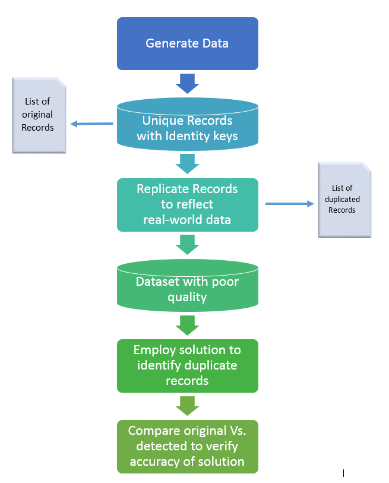

\fontsize{11}{22}

```{r setup, include=FALSE}
knitr::opts_chunk$set(message = FALSE, warning = FALSE)
```

# Introduction {#introduction}

Within the lifespan of any organization, multiple systems get harnessed into the IT estate.  Each of these systems tend to keep a version of the organizational data giving rise to concerns about the authenticity of data.  For any information, there should only be a single version of truth; however this contradicts with the organic, haphzard manner in which organizations grow.  

In this analysis while we look at customer records from a linkage context, the concept and solution is applicable to a wide scenario and range of problems.  

##Objective

The objective of this controlled experiment is to:  

1.  Set up a reproducible controlled experiment
2.  Test alternate deduplication solutions employing clerical, Machine Learning or Hybrid approaches  
3.  Validate the output by comparing the input to the output  
4.  Report the accuracy of the solution in quantitative terms  

##Experiment Framework:

The experiment framework is illustrated in the image that follows:  

 <center></center>


##Limitations:

The solution presented herein is based on simulated data.  The efficiency of the solution from its applicability depends on the extent to which the dataset can be made to reflect the poor quality of the input data.  

While the solution is defined, interpreted and solved in R, how this could be translated to an implementable solution within the IT landscape of any customer organization is beyond the scope of this exercise.    


##Acknowledgements:
The study has been done using the open source statistical tool R [@R-base], R Studio, Forecast [@Fcast2017],[@Fcast2016], and other packages.  
The project makes use of the R Project Template [@R-ProjectTemplate] for statistical configurations.  Reports are generated using Knitr, [@R-knitr] Bookdown [@R-bookdown], and R Markdown @R-rmarkdown packages.  Illustrations make extensive use of the ggplot2 [@R-ggplot2] package.

Citations acknowledge credit to the owners of the respective tools and packages:


