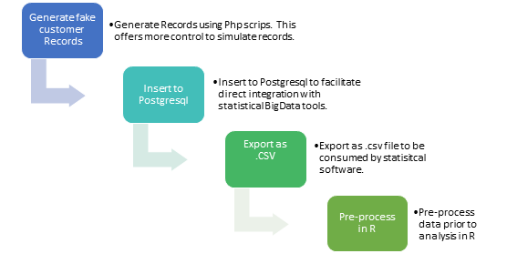

```{r load libraries, message=FALSE, warning=FALSE, include=FALSE}
setwd("D:/Assembla/deduplication/src")
wd <- getwd()
setwd("..")
parent <- getwd()
setwd(wd)

source("config/libraries.R")
source("lib/helpers.R")
#source("munge/01-A.R")
source("munge/03-A.R")
```

# Dataset and Simulation

This chapter explains the process of generating the dataset and the pre-processing steps to infuse real-world scenarios into it.

##Data Preparation  

The base dataset is one with 100K records, complete across all fields and unique in all aspects, representing 100% ideal data.  This is generated using PHP, directly into a Postgresql DB (for future BigData analytics), further exported to .csv files for processing in R.  

To conduct the base experiment, `r ds.count ` records are randomly sampled from the base population.  This dataset is taken through a "debasing" process to build real-world scenarios into it.  While simulating all scenarios will practically challenging, this provides control to define the quality of data for analysis.  The figure illustrates the data preparation processes:  
<span>

<center>
{width=120% }</center>
<h4><center>Figure.2.1 Data Generation Process</center></h4>
</span>


##Description of the Dataset

The following table gives a description of the dataset used for analysis:

Total number of rows in the base dataset = `r nrow(base.ds)`

Number of rows in the random sampled dataset = `r ds.count`


```{r chapter 2-1, echo=FALSE, message=FALSE, warning=FALSE}

panderOptions('table.alignment.default','left')
pander(desc.base.ds, caption="Description of Dataset", short= TRUE, split.tables=150)

```

The original dataset is unique across all fields.  Each of the records is furnished with an identity key so that it can be tracked from the input to the output. 

##Simulation of real world data quality:

The data is simulated to reflect real-life quality issues.  This is done programmatically so that its extent can be controlled and also repeated across multiple datasets for analysis.  

Once established, the solution could be applied across larger datasets to assess its extensibility and accuracy.  


```{r chapter 2-2, echo=FALSE, message=FALSE, warning=FALSE}
panderOptions('table.alignment.default','left')
pander(pre.process, caption="Preprocessing Dataset", short= TRUE, split.tables=250, 
       split.cells = c(15,30,55))
```

##Duplicate records created manually

The following table lists five sample records that have been created manually""

```{r chapter 2-3, echo=FALSE, message=FALSE, warning=FALSE}
panderOptions('table.alignment.default','left')
head.dupli.ds <- head(dupli.ds,3)

head.dupli.ds.a <- head.dupli.ds[,c(1:6)]
head.dupli.ds.b <- head.dupli.ds[,c(7:12)]
head.dupli.ds.c <- head.dupli.ds[,c(13:18)]
pander(head.dupli.ds.a, caption="Illustration of Duplicate Records", short= TRUE, split.tables=180, split.cells = c(15,45,35,35,20,30),keep.line.breaks = TRUE)
pander(head.dupli.ds.b, caption="Illustration of Duplicate Records ...contd", short= TRUE, split.tables=180, split.cells = c(20,28,42,42,20,28),keep.line.breaks = TRUE)
pander(head.dupli.ds.c, caption="Illustration of Duplicate Records ...contd", short= TRUE, split.tables=180, split.cells = c(35,60,40,15,15,15),keep.line.breaks = TRUE)

remove(head.dupli.ds,head.dupli.ds.a,head.dupli.ds.b,head.dupli.ds.c)
```

At this stage, the subset dataset reflects real-world data quality.  

###Preprocessing before deduplication

* Character strings are converted to lower case before comparison
* Multiple character spaces are modified to single character spaces


##Definitions of Quality and Accuracy

###Data Quality
Within the framework of the current experiment, quality refers to the quantity of "debasing" performed on the base data to make it simulate real-world data.  Quantitatively, the quality is expressed as the ratio between duplicate records to the total number of records.  While this definition does not claim scientific sanction, a quantitative representation of data quality and accuracy of the deduplication engine can be relatively represented by such a number.

$Quality = N(duplicates)/ N(total records) * 100$

###Accuracy
Accuracy refers to the number of duplicate records that the engine has been able to identify against the total number of duplicate records.  The experiment framework keeps track of the duplicate records and the count, and this facilitates one-on-one comparison with the output of the deduplication process.

$Accuracy = N(created duplicates) - N(identified duplicates)/ N(created duplicates)$


