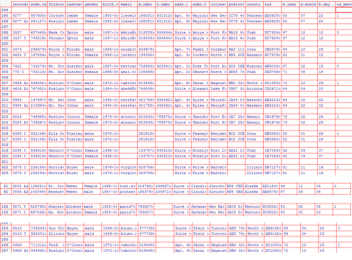

#Classification Experiment:

Table shows the output of Unsupervised, Supervised and Manual Classifications achieved on datasets of varied sizes.

```{r, echo=FALSE, message=FALSE, warning=FALSE}
panderOptions('table.alignment.default','left')
pander(TS.results, caption="Results from Classifications", short= TRUE, split.tables=150)
```

Legend for the classification results:


```{r, echo=FALSE, message=FALSE, warning=FALSE}
panderOptions('table.alignment.default','left')
pander(results.desc, caption="Legend for the Classification Table", short= TRUE, split.tables=200)
```


###Preparing a Minimal training set using clerical means

**Notes**
*  Iterations 1 to 5 uses individual Training sets created through clerical supervision  
*  Iteration 6 (50 K records) uses the Training set from (10 K records)  
*  The training set count increases from 30, 50, 90, 120, 150 across each of the iterations  

Clerical intervention is required in the case where a minimal training set is prepared.  The following figure shows the different scenarios and how the is_match column is updated to train the training set.  

This trained model is the input for Classification by the Machine.  

 <center></center>
